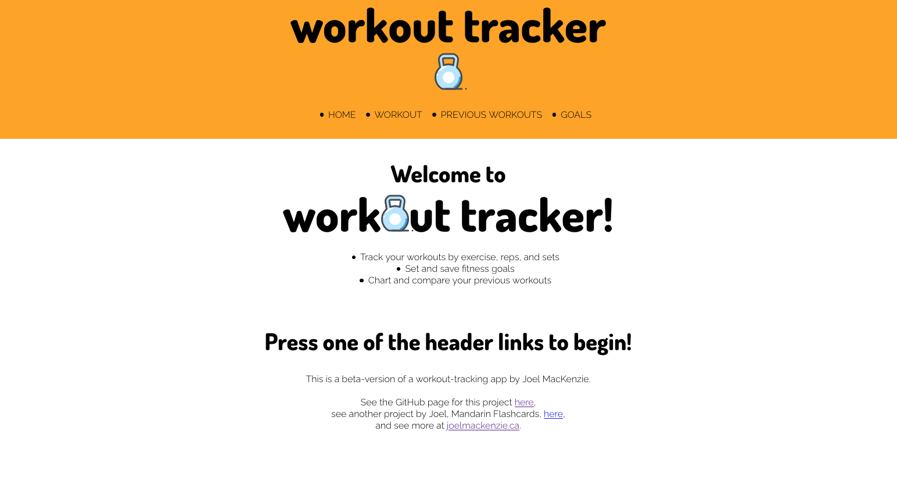
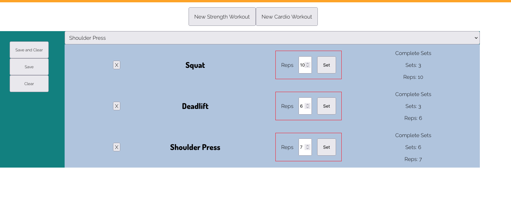

# Workout Tracker

Workout Tracker is a web app designed to keep track of workouts. A user can input, display, and view current and past workouts, categorized by strength training or cardio.

## Contributors

-   [Joel MacKenzie](https://github.com/joelmackenz)

## Technologies

-   React.js
-   JavaScript

## Usage

-   Check out a live demo here: https://joelmackenz.github.io/WorkoutTracker/

## Screenshoots

